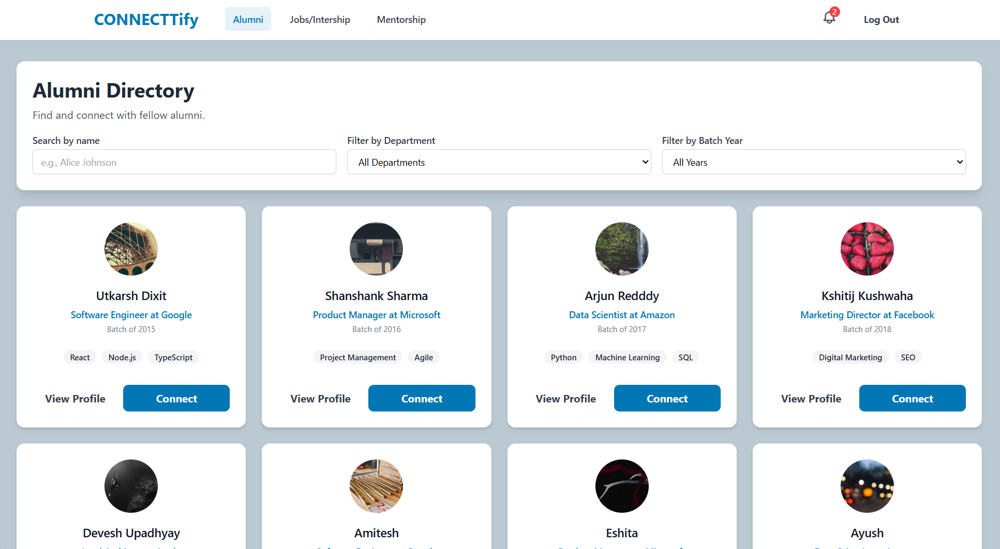
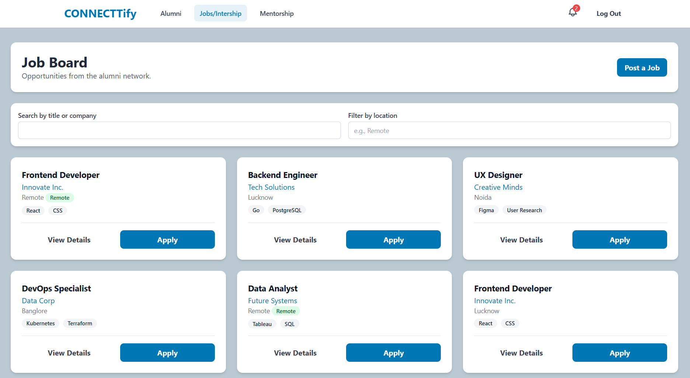
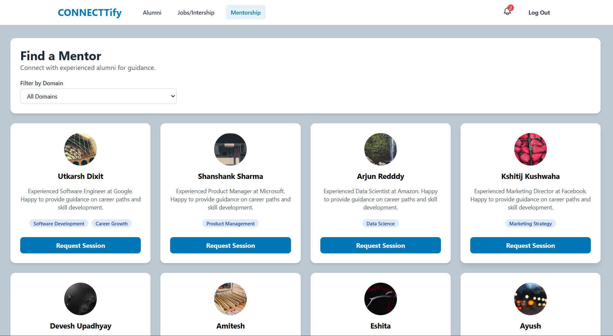

# 🎓 CONNECTtify

### An Alumni Networking & Career Platform

[](https://connecttify.onrender.com/)
[](https://react.dev/)
[](https://www.typescriptlang.org/)
[](https://vitejs.dev/)

</div>

---

## 🌐 Live Demo

> **Check it out live →** [https://connecttify.onrender.com/](https://connecttify.onrender.com/)

Use the following credentials to explore:

| Role    | Email                          | Access Level               |
|---------|-------------------------------|----------------------------|
| 🛡️ Admin   | `admin@connecttify.com`    | Full access + Admin Panel  |
| 🎓 Alumni  | `alumni@connecttify.com`   | View profiles, jobs, mentors |
| 🧑‍🎓 Student | Any other email              | Browse & explore           |

---

## 📸 Screenshots

### 🏠 Home — Alumni Directory


### 💼 Jobs & Internships Board


### 🧑‍🏫 Mentorship Page


---

## ✨ Features

### 👥 Alumni Directory
- Browse a searchable, filterable directory of 20+ alumni profiles
- Filter by **department**, **batch year**, or search by **name**
- Send **connection requests** with a personalized message modal
- View rich alumni profile cards with skills, current role & company

### 🧑‍💼 Detailed Profile Pages
- Full profile view with bio, projects, achievements & social links
- **Edit profile** functionality for alumni and admins
- Privacy settings: Public / Alumni Only / Admin Only
- Profile approval workflow (Pending → Approved)

### 💼 Jobs & Internship Board
- Browse job listings posted by alumni and recruiters
- Filter by job title, company, or location
- **Apply directly** via an in-app application form
- **Post new jobs** with a full form (title, company, skills, description, remote toggle)

### 🧑‍🏫 Mentorship
- Browse available mentors from the alumni network
- Filter mentors by **expertise domain** (Software Dev, Data Science, Product Management, etc.)
- **Book a session** by selecting an available time slot + adding a message
- Each mentor card shows their current role, bio, and domains

### 🛡️ Admin Dashboard *(Admin only)*
- Analytics cards: Total Alumni, Job Postings, Active Mentors, Pending Approvals
- **Interactive bar chart** (Recharts) showing platform activity over months
- **Profile Approval Queue** — Approve or reject pending alumni profiles in a table

### 🔔 Notifications
- Bell icon in the header with unread badge count
- Dropdown notification panel with read/unread state

### 🔐 Authentication
- Role-based access control (Admin / Alumni / Student)
- Protected routes — unauthenticated users redirected to login
- Admin-only routes with role-gating

---

## 🏗️ Tech Stack

| Layer        | Technology                              |
|--------------|-----------------------------------------|
| **Framework**  | React 19                              |
| **Language**   | TypeScript 5.8                        |
| **Build Tool** | Vite 6                                |
| **Routing**    | React Router DOM v7 (Hash Router)     |
| **Charts**     | Recharts 3                            |
| **Styling**    | Tailwind CSS (utility-first)          |
| **State**      | React Context API + `useState`        |
| **Deployment** | Render                                |

---

## 📂 Project Structure

```
connecttify/
├── components/
│   ├── Header.tsx        # Sticky nav with notification bell & mobile menu
│   └── ui.tsx            # Reusable UI primitives (Card, Button, Badge, Modal, Avatar, Toast, Input, Textarea)
│
├── context/
│   └── AuthContext.tsx   # Auth state, login/logout, role-based access
│
├── pages/
│   ├── LoginPage.tsx         # Entry page with mock email login
│   ├── AlumniDirectory.tsx   # Searchable alumni grid
│   ├── ProfilePage.tsx       # Detailed alumni profile + edit modal
│   ├── JobsPage.tsx          # Job board with apply & post modals
│   ├── MentorshipPage.tsx    # Mentor directory + session booking
│   └── AdminDashboard.tsx    # Analytics, charts & approval queue
│
├── App.tsx           # Root component with routing & protected routes
├── types.ts          # TypeScript interfaces and enums
├── constants.ts      # Mock data: users, alumni, jobs, mentors
├── index.css         # Global styles & Tailwind configuration
└── vite.config.ts    # Vite build configuration
```

---

## 🚀 Getting Started

### Prerequisites
- Node.js **v18+**
- npm or yarn

### Installation

```bash
# 1. Clone the repository
git clone https://github.com/Utkarshdixit11/connecttify.git
cd connecttify

# 2. Install dependencies
npm install

# 3. Start the development server
npm run dev
```

The app will be available at **`http://localhost:5173`**

### Build for Production

```bash
npm run build
npm run preview
```

---

## 🗺️ Route Map

| Path              | Page               | Access             |
|-------------------|--------------------|---------------------|
| `/login`          | Login Page         | Public              |
| `/`               | Alumni Directory   | All authenticated   |
| `/alumni/:id`     | Profile Page       | All authenticated   |
| `/jobs`           | Jobs Board         | All authenticated   |
| `/mentorship`     | Mentorship         | All authenticated   |
| `/admin`          | Admin Dashboard    | Admin only          |

---

## 🤝 Contributing

Contributions, issues and feature requests are welcome!

1. Fork the project
2. Create your feature branch (`git checkout -b feature/AmazingFeature`)
3. Commit your changes (`git commit -m 'Add some AmazingFeature'`)
4. Push to the branch (`git push origin feature/AmazingFeature`)
5. Open a Pull Request

---

## 👨‍💻 Author

**Utkarsh Dixit**

- GitHub: [@Utkarshdixit11](https://github.com/Utkarshdixit11)
- LinkedIn: [utkarshdixit9](https://www.linkedin.com/in/utkarshdixit9/)
- Live: [connecttify.onrender.com](https://connecttify.onrender.com/)

---

<div align="center">
  Made with ❤️ by Utkarsh Dixit
</div>
